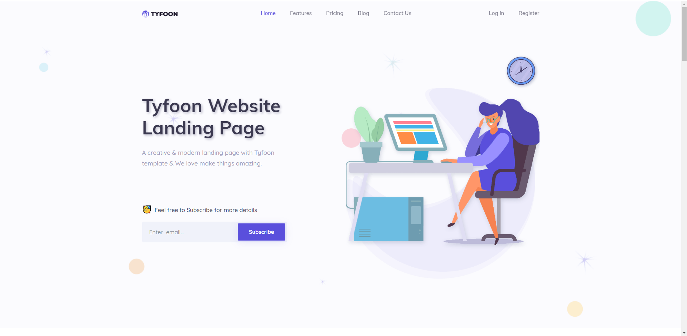
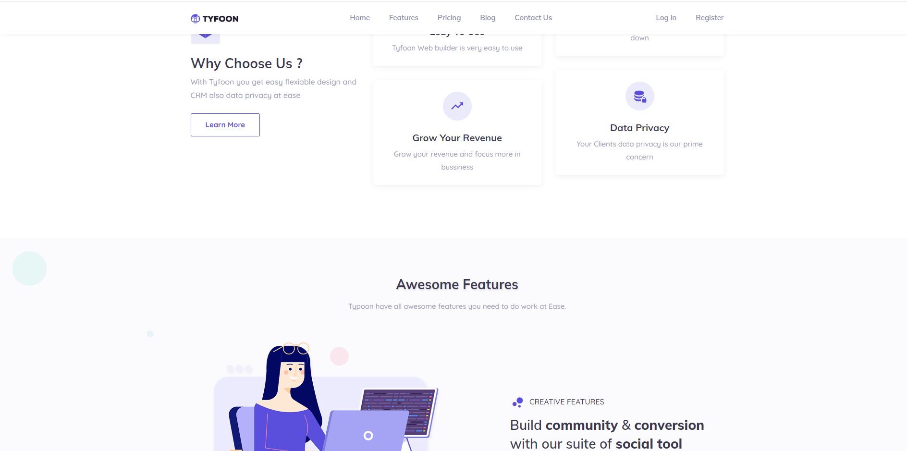

# Lezir - Tyfoon Web Page Template

  <h1>Tyfoon Web Page</h1>

  A headless, mobile responsive platform delivering ultra-fast, dynamic, personalized experiences. Beautiful web page fit anywhere, on any device.

 

 

## What makes Radikal special?

Tyfoon is a Responsive Material Web Page Template and written with Angular  and Bootstrap.

## Features

- Responsive layout (desktops, tablets, mobile devices)
- Built with Bootstrap v4.3.1
- Login, register pages

This project was generated with [Angular CLI](https://github.com/angular/angular-cli) version 9.0.3.

## Development server

Run `ng serve` for a dev server. Navigate to `http://localhost:4200/`. The app will automatically reload if you change any of the source files.

## Code scaffolding

Run `ng generate component component-name` to generate a new component. You can also use `ng generate directive|pipe|service|class|guard|interface|enum|module`.

## Build

Run `ng build` to build the project. The build artifacts will be stored in the `dist/` directory. Use the `--prod` flag for a production build.

## Running unit tests

Run `ng test` to execute the unit tests via [Karma](https://karma-runner.github.io).

## Running end-to-end tests

Run `ng e2e` to execute the end-to-end tests via [Protractor](http://www.protractortest.org/).

## Further help

To get more help on the Angular CLI use `ng help` or go check out the [Angular CLI README](https://github.com/angular/angular-cli/blob/master/README.md).
